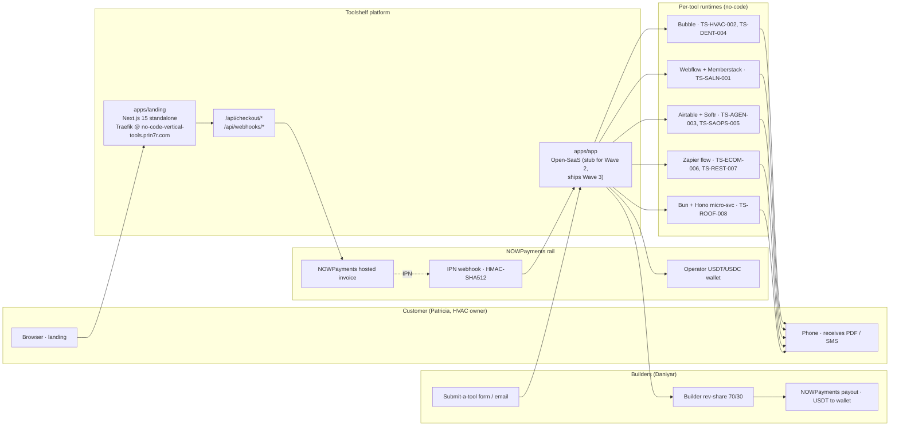

# 02 — Architecture

## System diagram (mermaid)



## Components

### `apps/landing` — Next.js 15 (App Router) + Tailwind 3.4

- **Public surface.** Catalog, tool cards, vertical filter chips, anatomy section, pricing, builder section, FAQ.
- **API routes**:
  - `POST /api/checkout/nowpayments` — creates a hosted invoice via `POST https://api.nowpayments.io/v1/invoice`. Returns `{ invoice_url, invoice_id, plan, mode }`.
  - `POST /api/webhooks/nowpayments` — receives IPN, verifies `x-nowpayments-sig` HMAC-SHA512 over the alphabetically-sorted JSON, logs the verified event. Wave 2 stub; wired to a DB write in Wave 3.
- **Build**: `output: 'standalone'` Next config, multistage Dockerfile, served on port 3000 inside the container.
- **Deploy**: Traefik labels point `no-code-vertical-tools.prin7r.com` → service `landing:3000` over TLS via the `letsencrypt` resolver on `storage-contabo`.

### `apps/app` — Open-SaaS (stubbed Wave 2)

- Folder exists with a README (`apps/app/README.md`). Wasp scaffold not yet bootstrapped. When bootstrapped (Wave 3), it owns:
  - Account / auth (email + Google).
  - Order ledger (id, plan, customer, payer, NOWPayments invoice id, paid status, install state, refund state).
  - Per-tool install wizard (Bubble auth, Webflow auth, Airtable PAT, Zapier OAuth).
  - Builder portal (publish a tool, payout history, KYC status from NOWPayments).
  - Internal admin (cohort management, monthly tuning workflow, support escalation queue).

### Per-tool runtimes — no-code stacks

Each tool runs on the no-code platform that fits its workflow:

| SKU | Stack | Why |
|---|---|---|
| TS-HVAC-002 (quote generator) | Bubble + PDF-rocket plugin | Form-heavy, branded PDF, Stripe link |
| TS-DENT-004 (no-show predictor) | Bubble + Twilio | Risk model is a SQL view; SMS via Twilio |
| TS-REST-007 (table-turn) | Airtable + Softr | POS CSV import; manager dashboard view |
| TS-SALN-001 (rebook reminder) | Webflow + Memberstack + Twilio | Branded landing + 1-tap confirm flow |
| TS-AGEN-003 (invoice chaser) | Airtable + Make.com | Xero/FreshBooks read; drafts to Gmail |
| TS-SAOPS-005 (churn flag) | Airtable + Posthog API + Slack | Cross-source signal join |
| TS-ECOM-006 (cart-to-WhatsApp) | Zapier + WhatsApp Business API | Shopify webhook → 9-min delay → WA |
| TS-ROOF-008 (scope emailer) | Bun + Hono micro-svc | Photo upload + tagging needs a tiny custom svc |

### Payment rail — NOWPayments

- Live API access verified in `payments-prototypes/`. Same key reused across all Wave 2 deploys for batch.
- Hosted invoice flow: `POST /v1/invoice` with `price_amount`, `price_currency`, `order_id`, `order_description`, `ipn_callback_url`, `success_url`, `cancel_url`. Customer is redirected to the NOWPayments-hosted page; can choose USDT (TRC20/ERC20), USDC, BTC, ETH, or a card-to-stablecoin on-ramp.
- IPN: NOWPayments POSTs the order status to `/api/webhooks/nowpayments` with `x-nowpayments-sig` header. Signature is HMAC-SHA512 of the alphabetically sorted JSON payload, keyed on `NOWPAYMENTS_IPN_SECRET`. Verifier copied from `payments-prototypes/src/lib/signatures.ts`.

## Data flows

### 1. Visitor → installed tool (single-tool tier)

```
visitor → landing → /api/checkout/nowpayments
  → NOWPayments hosted page (USDT / USDC / BTC / card on-ramp)
  → customer pays → NOWPayments POST /api/webhooks/nowpayments (HMAC-SHA512)
  → handler verifies, logs verified=true (Wave 2)
  → orders@toolshelf.cash receives manual notification (Wave 2 fallback)
  → human installs the no-code template into the customer's account
  → customer receives install confirmation email + setup video link
```

In Wave 3, the human-install step is replaced by an in-app install wizard.

### 2. Builder publish

```
builder → /api/builders/apply (Wave 3) — currently mailto:builders@toolshelf.cash
  → operator review (3 business days)
  → approved → builder ships Bubble/Webflow/Airtable template + asset bundle
  → operator publishes catalog row + sets price + assigns SKU
  → on each install: 70% of the monthly fee accrues to builder
  → 5th of each month: NOWPayments payout to builder USDT wallet
```

## Deploy topology

```
Cloudflare DNS (wildcard *.prin7r.com → 161.97.99.120)
        │
        ▼
storage-contabo (root@161.97.99.120)
├── /var/run/docker.sock — Traefik provider source
├── dokploy-traefik (host network, exposedByDefault=false, letsencrypt resolver)
└── /opt/prin7r-deploys/no-code-vertical-tools/
    ├── .env (gitignored — populated from /Users/keer/.nth-kir-keys.env)
    ├── docker-compose.yml (env_file: .env, expose: "3000", traefik labels)
    ├── Dockerfile.landing (Next.js 15 standalone, multistage)
    └── apps/landing/ (Next.js source)
```

Traefik in host-network mode reads `traefik.http.routers.no-code-vertical-tools.rule=Host(\`no-code-vertical-tools.prin7r.com\`)` from the container's labels and routes to the container's bridge IP on port 3000. TLS termination via Let's Encrypt HTTP-01 challenge.

## Operational notes

- **Secrets**: live NOWPayments keys live only in `/opt/prin7r-deploys/no-code-vertical-tools/.env` on `storage-contabo` and in `/Users/keer/.nth-kir-keys.env` on the operator's laptop. Never committed.
- **Logs**: container stdout → `docker logs no-code-vertical-tools` → forwardable to Loki when wired.
- **Rollback**: `git pull origin main` on the host followed by `docker compose build --no-cache && docker compose up -d`. No DB to migrate at Wave 2.
- **Monitoring**: `curl -sI https://no-code-vertical-tools.prin7r.com` from the operator's laptop; full e2e checkout test once a week (creates an unpaid invoice, no real money).
