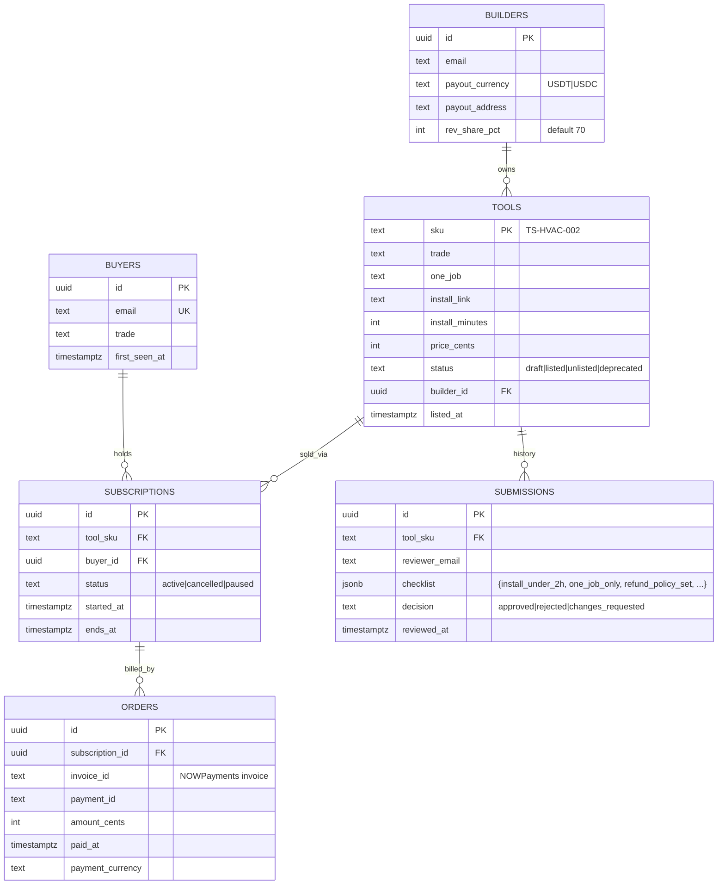

# 12 · Technical specification

> Toolshelf = catalog of vertical no-code tools. Wave 2: landing + crypto checkout + builder submit
> form. Wave 3: subscription billing, install-link minting, curator queue, builder rev-share payouts.

## 1. Architecture overview

```mermaid
flowchart LR
  subgraph Edge[storage-contabo · Traefik]
    Tr[Traefik]
  end
  subgraph Landing[apps/landing · Next.js 15]
    L[Catalog + tool detail]
    CK[/api/checkout/nowpayments]
    WH[/api/webhooks/nowpayments]
    SUB[/builders · submit form]
  end
  subgraph App[apps/app · Wave 3 · Open-SaaS]
    BD[Builder dashboard]
    CD[Curator queue]
    SD[Subscriber self-serve]
  end
  subgraph Workers
    INSTALL[Install-link minter]
    PAYOUT[Monthly rev-share payout]
    DEPRECATE[API-break monitor]
  end
  subgraph Data
    PG[(Postgres)]
    OBJ[(B2 · screenshots)]
  end
  subgraph Tools[Per-tool runtimes]
    BUB[Bubble]
    WF[Webflow + Memberstack]
    AT[Airtable + Softr]
    ZAP[Zapier]
    HONO[Bun + Hono micro-svc]
  end
  subgraph Ext
    NP[NOWPayments]
    PM[Postmark]
    SLACK[Slack notifications]
  end
  Tr --> L
  L --> CK --> NP --> WH
  WH --> INSTALL --> PM
  L --> SUB --> CD
  CD --> BD
  SD --> NP
  PAYOUT --> NP
  DEPRECATE --> SLACK
```

**Topology.** Single VPS (storage-contabo). Landing on :3000. App on :3100 (Wave 3). Workers in
the same compose project. Postgres + B2 external.

## 2. Data model



Indexes: `tools.trade`, `subscriptions.status`, `(orders.invoice_id, orders.payment_id)` UNIQUE.

## 3. API contracts

### Wave 2 (public)

| Method | Path | Auth | Request | Response |
|---|---|---|---|---|
| POST | `/api/checkout/nowpayments` | none | `{tool_sku, buyer_email}` | `{invoice_url, invoice_id}` |
| POST | `/api/webhooks/nowpayments` | HMAC-SHA512 | NOWPayments IPN | `{ok: true}` |
| POST | `/api/builders/submit` | none + captcha | `{builder_email, trade, one_job, install_link, screenshot_urls}` | `{submission_id}` |
| GET | `/api/healthz` | none | — | `{status}` |

### Wave 3 (operator + buyer)

| Method | Path | Auth | Body |
|---|---|---|---|
| GET | `/api/operator/queue` | session(operator) | — |
| POST | `/api/operator/submissions/:id/approve` | session(operator) | `{checklist, notes}` |
| POST | `/api/operator/tools/:sku/deprecate` | session(operator) | `{reason}` |
| POST | `/api/buyers/me/subscriptions/:id/cancel` | session(buyer) | `{}` |
| POST | `/api/payouts/run` | cron+token | `{month: "2026-04"}` |

## 4. Integrations

| 3rd-party | Auth | Rate | Fallback |
|---|---|---|---|
| NOWPayments | `x-api-key` + IPN HMAC | 100 RPM | Manual invoice via operator |
| NOWPayments mass-payout | API key | 50 outgoing/hour | Manual USDT send |
| Postmark | server token | 10k/day free | Resend after retry; alert |
| Slack incoming webhook | secret URL | 1/sec | Email digest |
| Bubble / Webflow / Airtable / Zapier (per-tool) | builder owns these | n/a | Builder responsibility |
| Cloudflare Turnstile (captcha for submit) | site key + secret | n/a | Operator review of all submissions |

## 5. Storage

- Postgres 16 — single instance, 1GB MVP.
- B2 — bucket `prin7r-toolshelf-screenshots`, 30-day lifecycle on rejected submissions.
- No PII besides email; `buyers.email` UNIQUE; no last name, no payment card stored.
- Retention: deactivated buyer rows kept 24mo for accounting, then anonymized.

## 6. Auth

- **Wave 2:** none (public landing). Submit-form is captcha-gated.
- **Wave 3:** Wasp magic-link auth. Roles: `buyer`, `builder`, `operator`. Operator role assigned by
  flag set in admin SQL.
- Sessions: 30-day rolling, HttpOnly Secure SameSite=Lax.

## 7. Security

- Secrets in `.env` only. No secrets in client bundles.
- Rate limits: checkout 30/IP/hr; submit 5/IP/hr (post-captcha); payout 1/day total.
- CSRF: same-origin enforcement on Wave 3 mutating endpoints.
- PII: emails only; encrypted at rest (Postgres pgcrypto on `email_encrypted` if Wave 4 adds payout
  card details).
- Audit log: every approval, deprecation, refund, payout — append-only.

## 8. Observability

- Pino JSON logs; shipped to Loki on storage-contabo (Wave 3).
- Metrics: `toolshelf.checkout.invoice_to_paid_ms`, `toolshelf.subscription.active`, `toolshelf.submission.queue_depth`.
- Trace propagation: `traceparent` end-to-end.
- Alerts: queue depth >5/3d, payout failure >0, NOW IPN 4xx >10/hr.

## 9. Performance budgets

| Path | p50 | p95 |
|---|---|---|
| `/` LCP | 1.5s | 2.5s |
| Catalog filter (client) | 50ms | 150ms |
| Checkout round-trip | 700ms | 1.5s |
| Submit form post | 400ms | 1s |
| Curator queue load | 200ms | 600ms |
| Payout batch (50 builders) | — | 30s |

Throughput: 200 IPNs/min sustainable.

## 10. Non-goals

- A no-code builder (we sell finished tools, not a platform).
- Free tier (always $39/mo; trials are 14-day refund window).
- Multi-tool bundles or discounts.
- Native mobile app.
- Per-region pricing.
- Affiliate / referral program in Wave 2/3 (Wave 4 candidate, not committed).
- Tool reselling (no white-label).
